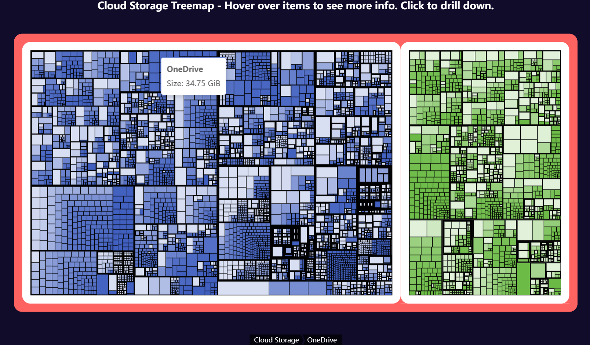

# CloudMapper: Open-source tool to map and visualize your cloud storage landscape.


[](LICENSE)
[](https://github.com/tesserato/CloudMapper)

CloudMapper is a command-line utility designed to help you understand and analyze your cloud storage. It uses [rclone](https://rclone.org) to interface with various cloud storage providers, gathers information about your files and their structure, and then generates several insightful reports, including:

*   A detailed tree view of your files and folders.
*   A report on duplicate files (based on hashes).
*   A summary of file extensions and their storage consumption.
*   A size usage report per remote and overall.
*   An interactive HTML treemap visualization of your storage.

## Example Output Snippets

**`treemap.html`: (For an similar, interactive example, click [here](https://echarts.apache.org/examples/en/editor.html?c=treemap-disk))**




**`files.txt` (Single/Remotes Mode) or content within Folders Mode:**

```text
☁️ my-gdrive: 15.21 GiB
  📁 Documents 💽 5.1 GiB 📆 2023-10-26T10:00:00Z
    📄 report.docx 💽 1.2 MiB 📆 2023-10-25T09:00:00Z
    📁 Old Reports 💽 4.8 GiB 📆 2023-01-10T15:30:00Z
      📄 old_report_2022.pdf 💽 10.5 MiB 📆 2023-01-09T11:00:00Z
      ...
  📁 Photos 💽 10.11 GiB 📆 2023-10-27T11:00:00Z
    📄 IMG_0001.JPG 💽 4.5 MiB 📆 2023-09-01T14:00:00Z
    ...
```

**`duplicates.txt`:**

```text
Total size occupied by all files identified as duplicates: 2.5 GiB
Found 5 sets of files with matching hashes.
Total potential disk space saving by removing duplicates (keeping one copy of each): 1.5 GiB

Duplicates found with size: 1 GiB (2 files, potential saving: 1 GiB)
  - my-gdrive:backups/archive.zip
  - my-s3:important-backups/archive.zip
  Matching Hashes: SHA-1: abc..., MD5: def...

Duplicates found with size: 500 MiB (3 files, potential saving: 1 GiB)
  - my-dropbox:shared/project_data.dat
  - my-gdrive:project_x/data/project_data.dat
  - my-onedrive:archive/project_data.dat
  Matching Hashes: SHA-256: 123..., QuickXorHash: 456...
...
```

**`extensions.txt`:**

```text
Total Files Found: 12345 (Total Size: 55.8 GiB)
-------------------------------------
Extension       |      Total Size |   File Count |  % Size |  % Count
--------------------------------------------------------------------
.mkv            |       25.2 GiB |          150 |  45.16% |   1.22%
.zip            |       10.1 GiB |         1200 |  18.10% |   9.72%
.jpg            |        8.5 GiB |         8500 |  15.23% |  68.85%
.pdf            |        2.0 GiB |          500 |   3.58% |   4.05%
[no extension]  |      500.0 MiB |           25 |   0.88% |   0.20%
...
```


## Features

*   **Comprehensive Analysis**: Leverages `rclone lsjson` and `rclone about` for detailed data.
*   **Multiple Output Modes**:
    *   `single`: A single text file for all remotes.
    *   `remotes`: One text file per remote.
    *   `folders`: A local directory structure mirroring your remotes.
*   **Insightful Reports**:
    *   File/Folder tree structure with sizes and modification dates.
    *   Duplicate file detection across remotes.
    *   File extension statistics (count, total size, percentages).
    *   Overall and per-remote size usage.
    *   `rclone about` summary.
*   **Interactive Visualization**: Generates an HTML treemap using [ECharts](https://echarts.apache.org/en/index.html) for a visual overview of storage distribution.
*   **Configurable**: Control which reports are generated, rclone path, config file, and output location.
*   **Parallel Processing**: Utilizes Rayon for faster processing of multiple remotes.

## Prerequisites

*   **Rust**: Ensure you have Rust installed. You can get it from [rustup.rs](https://rustup.rs/).
*   **rclone**: `rclone` must be installed and configured with the remotes you want to analyze. CloudMapper will attempt to use `rclone` from your system's PATH, or you can specify a path to the executable.

## Installation

1.  **Clone the repository:**
    ```bash
    git clone https://github.com/tesserato/CloudMapper.git
    cd CloudMapper
    ```

2.  **Build the project:**
    ```bash
    cargo build --release
    ```
    The executable will be located at `target/release/cloudmapper`.

3.  **(Optional) Add to PATH:**
    You can copy the executable to a directory in your system's PATH for easier access, e.g., `~/.local/bin/` or `/usr/local/bin/`.

## Usage

```bash
cloudmapper [OPTIONS]
```

**Common Options:**

*   `-r, --rclone-path <RCLONE_PATH>`: Path to a specific rclone executable.
*   `-c, --rclone-config <RCLONE_CONFIG>`: Path to a specific rclone configuration file.
*   `-o, --output-path <OUTPUT_PATH>`: Directory for generated reports (default: `./cloud`).
*   `-m, --output-mode <OUTPUT_MODE>`: Output structure for the file list report (`single`, `remotes`, `folders`; default: `folders`).
*   `-d, --duplicates <true|false>`: Enable duplicate file report (default: `true`).
*   `-e, --extensions-report <true|false>`: Enable file extensions report (default: `true`).
*   `-a, --about-report <true|false>`: Enable 'rclone about' report (default: `true`).
*   `-t, --html-treemap <true|false>`: Enable HTML treemap report (default: `true`).
*   `-k, --clean-output <true|false>`: Clean output directory before generating reports (default: `true`).
*   `--help`: Show help message.
*   `--version`: Show version information.

**Example:**

```bash
# Analyze all configured rclone remotes and save reports to the default './cloud' directory
./target/release/cloudmapper

# Analyze remotes, save to a custom directory, and only generate the treemap and size reports
./target/release/cloudmapper -o ./my_cloud_analysis --duplicates false --extensions-report false --about-report false

# Use a specific rclone binary and config, output in single file mode
./target/release/cloudmapper --rclone-path /opt/rclone/rclone --rclone-config ~/.config/rclone/rclone.conf -m single
```

For detailed options, run `cloudmapper --help`.

## Reports Generated

By default, CloudMapper generates the following files in the specified output directory (e.g., `./cloud/`):

*   **File Structure Report(s):**
    *   `files.txt` (in `Single` and `Folders` mode; for `Folders` mode, this file is created within each directory)
    *   `_<RemoteName> files.txt` (in `Remotes` mode, one per remote)
*   **`duplicates.txt`**: Lists files with identical hashes.
*   **`extensions.txt`**: Summarizes file counts and total sizes per extension.
*   **`size_used.txt`**: Reports calculated total size per remote and grand total.
*   **`about.txt`**: Summarizes storage usage from `rclone about`.
*   **`treemap.html`**: An interactive HTML treemap visualization.

## License

This project is licensed under the **MIT License**. See the [LICENSE](LICENSE) file for details.

## Keywords

`cloud`, `treemap`, `visualization`, `rclone`, `storage`, `echarts`

## Categories

*   `command-line-utilities`
*   `visualization`
*   `filesystem`
*   *(TODO: Add two other categories)*

## Contributing

Contributions are welcome! Please feel free to submit issues, fork the repository and send pull requests.

## Repository

[https://github.com/tesserato/CloudMapper](https://github.com/tesserato/CloudMapper)
